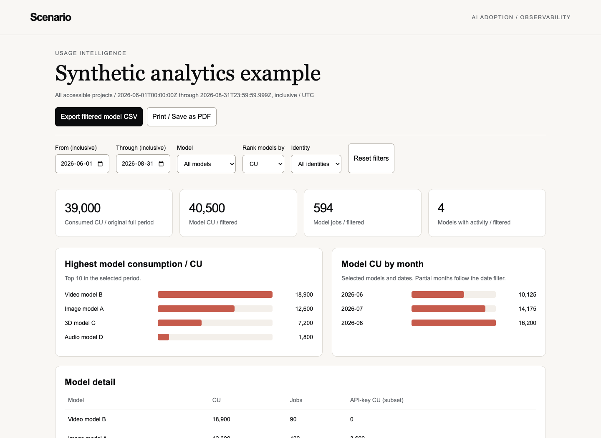
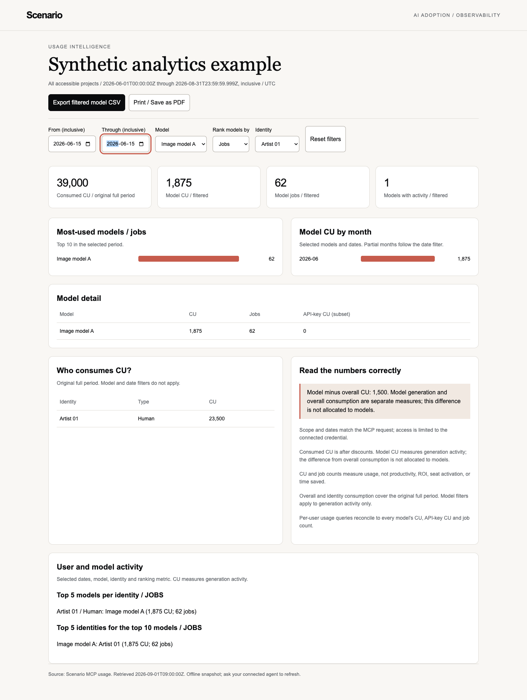
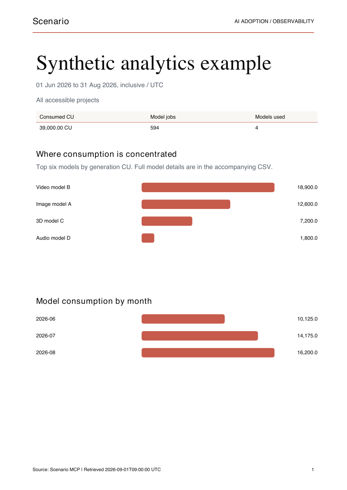
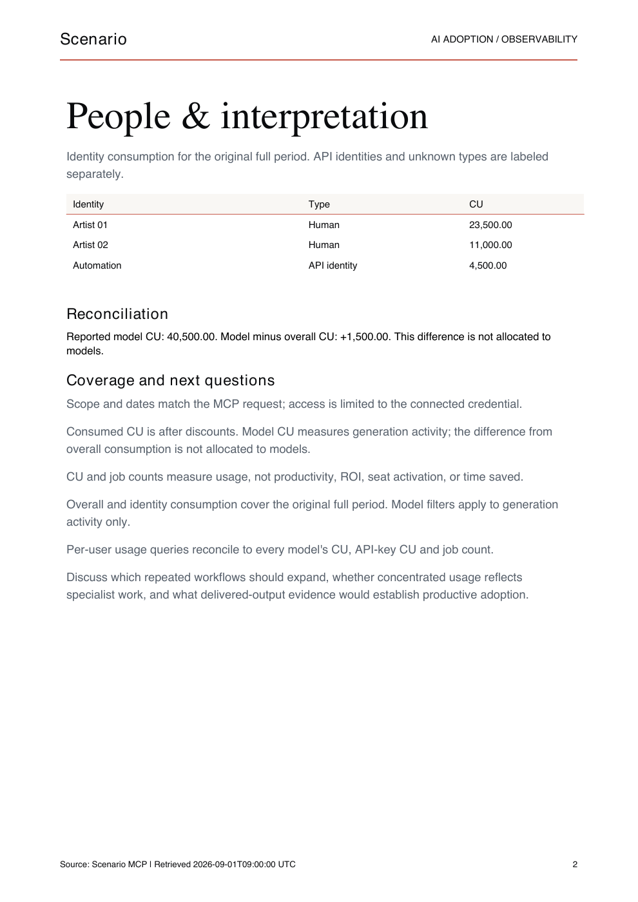
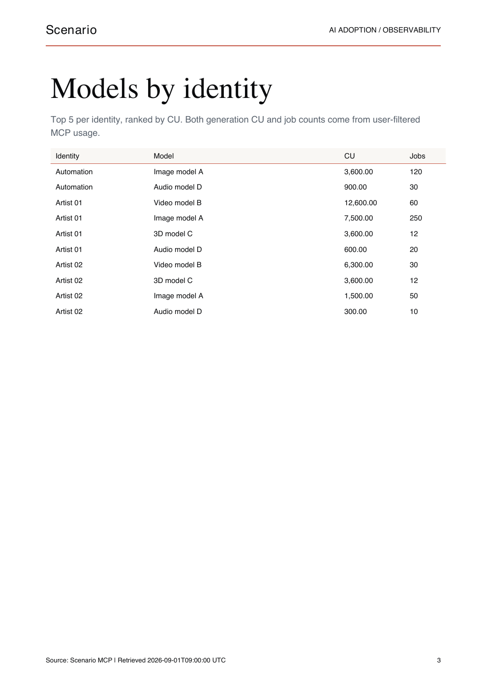
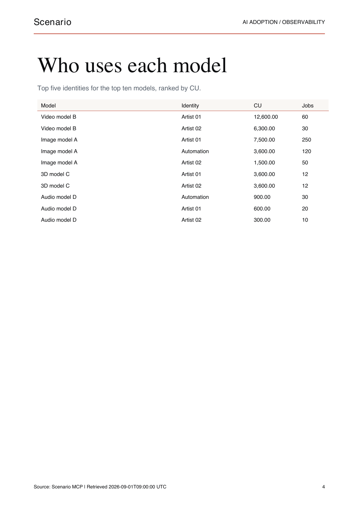

# Admin analytics validation evidence

The live application test passed with notes at commit `8ed2b5423d978cd66d3eb2a69c004b11cd107259` on September 17, 2026 UTC. [Live validation results](live-validation.json) record the checks without customer identifiers or usage figures.

**Every screenshot, PDF, dashboard, CSV, and snapshot in this directory uses fictional data.** They demonstrate the shipped renderer, separately from the live MCP test. Names, identifiers, metrics, and retrieval timestamps in the example are synthetic. The live screenshots and raw responses remain private.

## Live application test

A fresh managed agent received the installed analytics and connection skills and a task: compare project and organization rankings, produce the top five models per user by CU with job counts, export three complete calendar months, generate local reports, then rerank by jobs from cache. The runtime did not expose its model identifier.

| Check            | Result                                                                                                                                                                    |
| ---------------- | ------------------------------------------------------------------------------------------------------------------------------------------------------------------------- |
| Spec validation  | All 62 published skills passed                                                                                                                                            |
| Repository tests | Passed, including all 16 analytics tests                                                                                                                                  |
| MCP collection   | 15 usage reads; zero generations, estimates, uploads, or Scenario writes                                                                                                  |
| Scope and dates  | Project/team filters and inclusive bounds matched the responses                                                                                                           |
| User attribution | Every consumption identity collected; each model's CU, jobs, API subset, and time buckets reconciled                                                                      |
| Accounting       | Recorded usage categories explained the difference; overlapping totals excluded                                                                                           |
| CSV exports      | Both ranking modes and every model/month metric independently reproduced from source data                                                                                 |
| Cache reuse      | Fresh lookup required per-user coverage; jobs rerank made no new MCP fetch and retained retrieval timestamps                                                              |
| PDF review       | All five live report pages and two supplement pages inspected                                                                                                             |
| Browser review   | Identity/model/date filters, single-day bounds, metric selection, filtered export, invalid dates, reset, and mobile layout passed; no external requests or browser errors |

Calls were checked against the public [tool reference](https://mcp.scenario.com/docs/tools) and [usage contract](https://mcp.scenario.com/docs/tools/usage). No confirmed skill or helper defect was reproduced.

The standalone CLI attempt stopped at local permission restrictions before data collection. The managed agent completed the test; this does not certify every host integration or the chat-only fallback. Nonzero discounts were tested with regression fixtures, not observed in the live sample. Activity pagination was not exhausted because complete usage time buckets supplied the accounting explanation. One initial unfiltered discovery response included signed metadata in private tool output; later output was field-selected and public evidence excludes it. A local supplement supplied the cross-scope comparison and accounting narrative beyond the generic report.

## Synthetic dashboard screenshots

These examples were rendered from [synthetic-snapshot.json](synthetic-snapshot.json) with the unchanged helper. [Synthetic checks](synthetic-checks.json) record a separate browser and PDF review. Download [dashboard.html](example/dashboard.html) and open it locally to try the filters.



The filtered example selects one fictional identity, one model, and one inclusive day. Overall consumption remains labeled for the original full period.



[Mobile screenshot](screenshots/dashboard-mobile.png)

## Synthetic PDF and exports

The [four-page PDF](example/report.pdf) contains charts, identity consumption, model rankings per identity, and identities per model. Its shorter tables produce fewer pages than the private live report.

| Overview                                               | Accounting and identities                              |
| ------------------------------------------------------ | ------------------------------------------------------ |
|  |  |

| Models per identity                                    | Identities per model                                   |
| ------------------------------------------------------ | ------------------------------------------------------ |
|  |  |

[Markdown report](example/report.md), [monthly CSV](example/models-monthly.csv), [top models per user](example/top-models-per-user.csv), and [top users per model](example/top-users-per-model.csv) contain the same fictional dataset.

## Reproduce locally

From the repository root, with Python 3.10+ and the test requirements installed:

```bash
python3 skills/scenario-admin-analytics/scripts/analytics.py render \
  --snapshot tests/scenario-admin-analytics/evidence/synthetic-snapshot.json \
  --out /tmp/scenario-analytics-example \
  --title "Synthetic analytics example" \
  --rank-by cu --top-models-per-user 5 --names --pdf

pdftoppm -png -scale-to 1400 \
  /tmp/scenario-analytics-example/report.pdf \
  /tmp/scenario-analytics-example/report-page
```

Use `--rank-by jobs` for frequency rankings. This is an offline fixture render and makes no MCP calls. The snapshot's historical timestamps are preserved, so it is not a fresh cache for a live request. PDF creation needs ReportLab; image rendering needs Poppler. Browser screenshots used desktop 1440 by 1050 and mobile 390 by 844 viewports.

Run `/skills:validate scenario-admin-analytics` for a new live application test after substantive changes. Keep its private data outside the repository.
